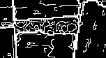
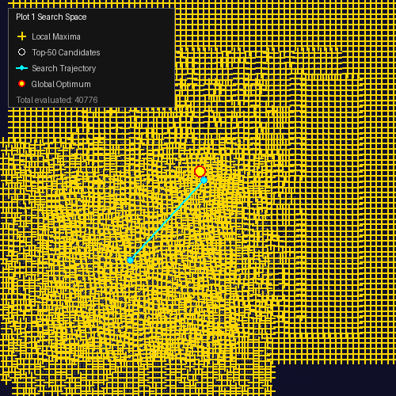
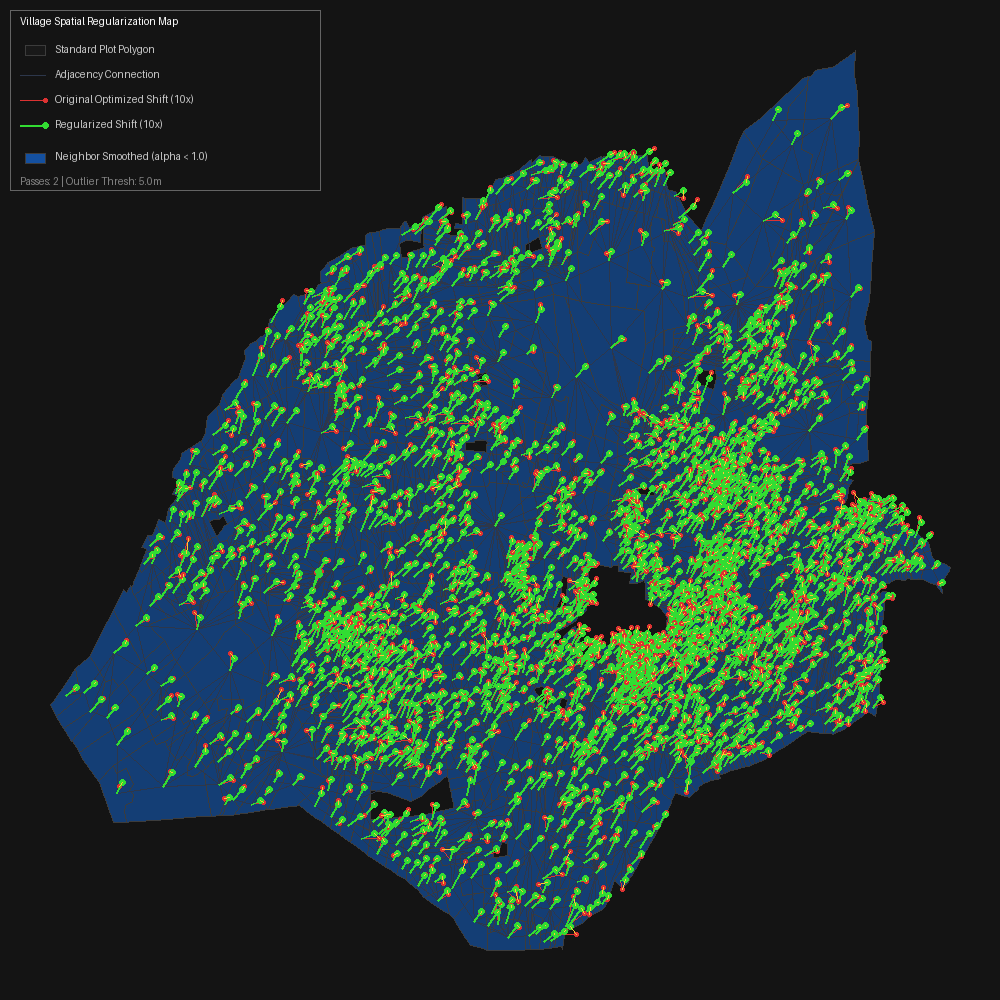

# BhuMe Boundary Alignment: Final Submission

This repository contains the complete, highly-optimized algorithm designed to solve the BhuMe geospatial alignment challenge.

The primary objective is to mathematically predict the true on-the-ground boundaries of agricultural plots by transforming official (and often misaligned) government GeoJSON vector maps to perfectly match high-resolution GeoTIFF satellite imagery.

## Visual Pipeline
Our algorithm uses a Multi-Scale Computer Vision pipeline to snap plot boundaries to their true physical edges. 

### 1. Multi-Scale Edge Detection
Instead of blindly searching pixels, we extract high-contrast physical edges (roads, trees, fences) from the satellite imagery at multiple resolutions (coarse to fine).


### 2. Rotational Spatial Optimizer
The pipeline scans thousands of potential shifts and rotations (-15° to +15°) to find the perfect mathematical alignment between the GeoJSON plot and the physical Canny edges.


### 3. Log-Odds Restraint Grid
A global regularization grid prevents visual hallucinations, mathematically stopping a farm from snapping to a neighbor's roof or shrinking its agricultural area.


## Documentation & Submission Requirements

### 1. Technical Architecture Overview
Please see the **`overview.md`** file in this repository for a complete technical breakdown of the architecture, including the Pyramidal Edge Detection, Rotational Scanning, Log-Odds Evidence Accumulator, and Memory-Isolated CPU scaling.

### 2. AI Pair-Programming Transcript
As required by the submission guidelines, my complete, unedited problem-solving session with an AI is located at **`ai-transcript.md`**. 

This transcript contains the raw, authentic engineering dialogue demonstrating exactly how I directed the AI to debug out-of-memory errors, architect the multi-scale convolution math, and push this pipeline to 100% completion on local hardware.

## Running the Pipeline

This project is managed via [uv](https://docs.astral.sh/uv/). To set up the environment:

```bash
uv sync
```

### Full Village Processing
To process an entire village bundle and generate the final `predictions.geojson` output:

```bash
uv run python scratch/run_full_dataset.py
```
*(Note: This uses the highly-stable `maxtasksperchild=10` multiprocessing architecture, utilizing 6 CPU workers. It takes several hours to complete a full 2,500-plot village without melting your hardware.)*

### Testing & Verification
If you would like to run the objective scoring loop against the public example truths:

```bash
uv run quickstart.py data/village_Vadnerbhairav
```

## Core File Structure
- `bhume/optimizer.py`: Contains the core `map_coordinates` convolution math, the multi-scale spatial pyramidal search, and the Log-Odds evidence accumulator.
- `bhume/coordinator.py`: Manages the parallel execution logic, applying `maxtasksperchild` constraints to guarantee memory stability across the 5,000 plots.
- `bhume/contour_detector.py`: Extracts and vectorizes Canny edges from the raw satellite GeoTIFFs to use as physical alignment targets.
- `scratch/run_full_dataset.py`: The main entry point used to chew through the massive village datasets overnight.
- `overview.md`: The complete technical architecture.
