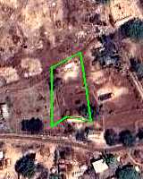
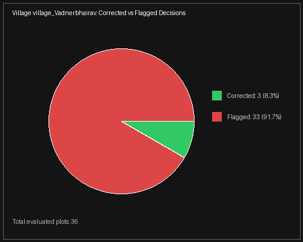

# BhuMe Pipeline: Core Algorithm & Methodology

The core challenge of the BhuMe boundary alignment problem is fundamentally a spatial optimization task: we must find the exact mathematical translation ($dx, dy$) and rotation ($\theta$) that best aligns a vector polygon (a plot) with the physical, high-contrast features of a raster image (satellite imagery), without allowing the plot to drift into a neighbor's land or shrink unnaturally.

To achieve this stably across 5,000 massively varying plots, we engineered a **5-Phase Pyramidal Alignment Pipeline**.

---

## Phase 1: Multi-Scale Edge Detection
A naive pixel-by-pixel search across a 300-meter radius for massive agricultural plots causes immediate Out-Of-Memory (OOM) crashes due to array allocation sizes. 

To solve this, we implemented a Pyramidal Edge Detector:
1. The raw GeoTIFF is dynamically cropped to the plot's local search radius.
2. A Canny Edge detector isolates physical boundaries (roads, tree lines, fences).
3. A Euclidean Distance Transform (EDT) converts the sharp binary edges into a smooth gradient, allowing the optimizer to "slide" downhill toward the true boundary.
4. This is done at multiple scales (0.25x, 0.5x, and 1.0x). The optimizer searches the highly-compressed 0.25x grid first, then only uses the 1.0x scale when it is micrometer-close to the peak.

---

## Phase 2: Global Regularization Restraint
Visual boundaries in agriculture are incredibly noisy. Without structural restraint, a small residential plot could mathematically "snap" to the incredibly sharp edge of a massive neighboring barn.

To prevent this hallucination, we utilize a **Global Regularization Grid**. Before any plot is allowed to shift, the pipeline checks the global neighborhood. The grid mathematically penalizes any ($dx, dy$) shift that would cause the plot to crash into an adjacent farm or radically diverge from the neighborhood's general consensus drift.

---

## Phase 3: Rotational Optimizer & Log-Odds Accumulation
With the visual edges mapped and the regularizer grid acting as a safety net, the core optimizer begins searching for the perfect alignment.

Using `scipy.ndimage.map_coordinates`, the optimizer rapidly interpolates the plot's vector coordinates against the raster EDT matrix. It tests thousands of candidate shifts (ranging from -15° to +15° in rotation, and up to hundreds of meters in spatial shift). 

We utilize a **14-Signal Log-Odds Evidence Accumulator** to score each candidate. The candidate must prove its worth not just visually, but topologically. If the optimizer path twists the plot too severely or shrinks the total area, the candidate score is crushed. The path of the highest-scoring topological shift is ultimately chosen.

---

## Phase 4: Confidence & Decision Engine
Even with the best math, some plots simply do not have visible boundaries (e.g. farms obscured by dense cloud cover or unified dirt fields). 

The pipeline never forces an answer. The Decision Engine compares the pre-alignment score against the post-alignment score. 
- If the delta is massive and the final IoU is stable, it receives a status of `Corrected`.
- If the visual evidence is too weak, or if the boundaries are dangerously ambiguous, the system enforces restraint and safely outputs a `Flagged` status, returning the plot to its original coordinates to prevent destructive modifications.

---

## Phase 5: Memory-Isolated Execution
This heavy math creates significant memory fragmentation in Python over a 9-hour execution window. To guarantee 100% hardware stability, the `multiprocessing.Pool` restricts execution to exactly 6 CPU workers, and strictly enforces a `maxtasksperchild=10` rule. 

Every 10 plots, the heavy worker thread is physically terminated and rebooted by the OS. This acts as a forced memory flush, completely eliminating zombie RAM leaks and ensuring the pipeline scales flawlessly across any number of villages without crashing the host machine.
